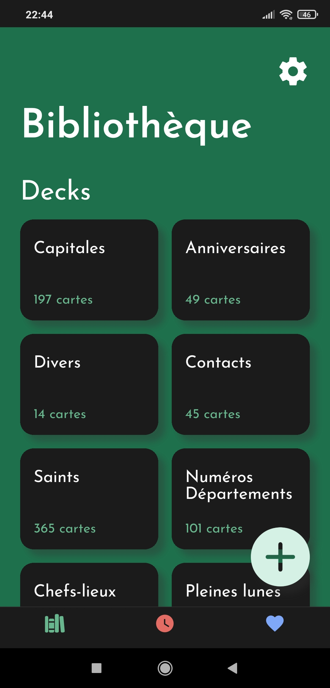
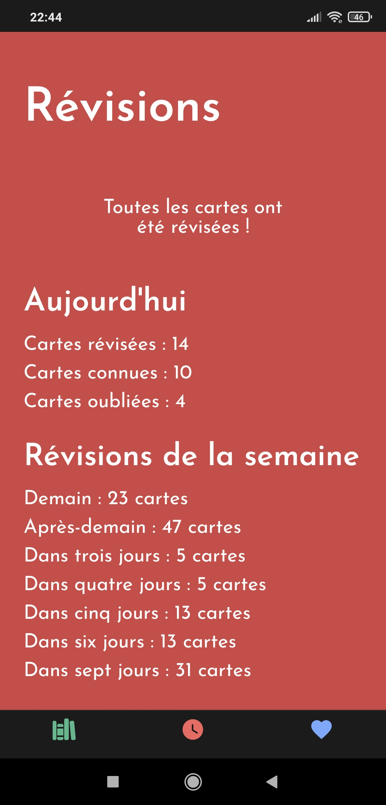
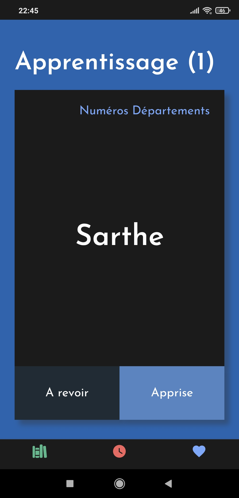
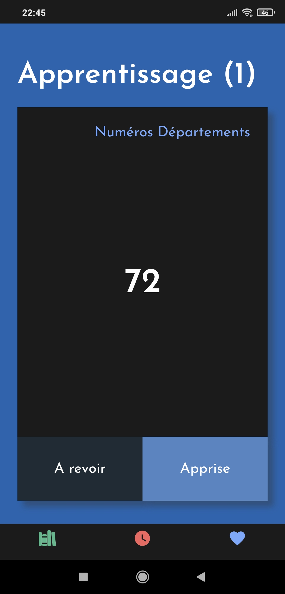

# ⚡ Flashcards

Ce projet est une application mobile de Flashcards développée en React Native avec Expo. Elle met en place un système de répétition espacée utile à l'apprentissage à long terme de connaissances. Le but de cette application est de réduire la charge organisationnelle de l'utilisateur·trice dans l'acquisition de ces connaissances. L'utilisation pensée lui demande ainsi de simplement d'ouvrir l'application chaque jour pour réviser les cartes qui lui sont présentées.

## 📱 Utilisation

L'application n'est pas encore déployée sur le Play Store. Son déploiement est prévu pour la fin de l'année 2025.

Elle peut être construite avec l'outil EAS d'Expo. Pour plus d'informations, vous pouvez consulter le [site officiel](https://expo.dev/eas#build). L'application fonctionne sur les appareils Android, elle n'a pas encore jamais été testée sur des appareils iOS.

Une [documentation utilisateur](https://github.com/valooozz/flashcards/blob/main/doc/Documentation%20Utilisateur.md) est également disponible sur le projet.

Voici quelques exemples de l'interface :

## 📆 Nouveautés prévues prochainement

- Gestion de plusieurs langues via un fichier de traduction
- Bouton dans l'onglet Apprentissage pour dire qu'on ne veut pas apprendre une carte
- Nouveau mode pour afficher trois boutons lors de la révision, pour plus de précision dans l'algorithme de répétition espacée
- Pouvoir indiquer sur le deck entier s'il faut alterner recto et verso pour les cartes du deck en question, avec une possibilité de surcharge au niveau de la carte, comme présent actuellement
- Pouvoir ne pas afficher le nom du deck lors des révisions
- Pouvoir repousser la révision d'une carte
- Meilleur système de notifications

## 📜 Licence

Ce projet est sous licence Mozilla Public License (MPL). Voir le fichier [LICENSE](https://github.com/valooozz/flashcards/blob/main/LICENSE) pour plus de détails.
